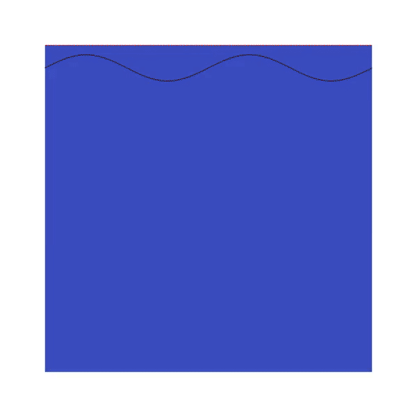

# 2couette

A two-fluid couette flow with bells and whistles, written in Basilisk C

---

Begin with a periodic channel of unit height between two horizontal plates. Fill the bottom 93% filled with water, and the top 7% with sunflower oil, both at 25°C. Introduce a small sinusoidal perturbation along the fluid interface. Hold the bottom plate stationary while moving the top plate at unit velocity in a direction along the channel.

This repo models the viscous flow of the system, incorporating the effects of surface tension and gravity using Basilisk C.

After installing Basilisk C and VLC and setting up Basilisk view,

    $ ./run.sh

builds and runs the simulation, while tracking it's progress watching a log file; after it is done, it prints to terminal notifying you to view the horizontal velocity profile animation with vlc.

Warning: running the simulation on the default settings takes a long time (about 17 minutes on an i3-4150!).

---

This is a real-time animation of the horizontal velocity profile (the scalar field `u.x`). This is from `t = 0` to `t = 10`.
